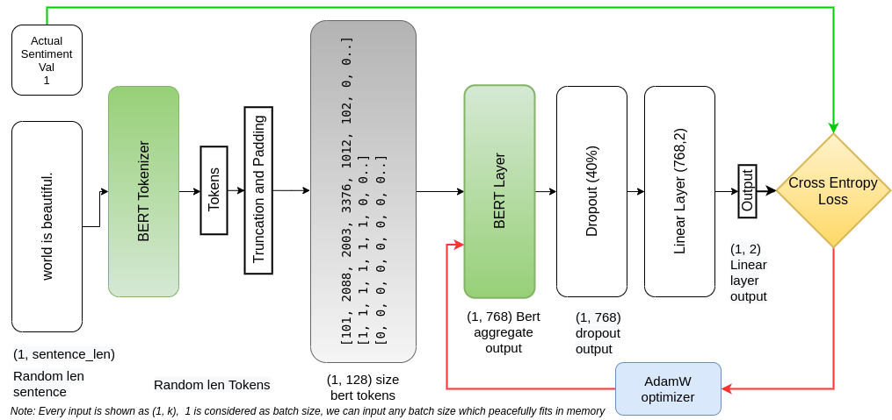

# BERTSentimentAnalysis
A project  on BERT fine tuning for Sentiment Analysis

BERT: It is a tranformer architecture model proposed in: <a href="https://arxiv.org/abs/1810.04805">BERT: Pre-training of Deep Bidirectional Transformers for Language Understanding</a>. By this method, we can pre-train general purpose language model and then fine tune it for a given task. BERT takes unlabled text 
as input, mask out 15% words, and tries to predict these words. Masked sentences propogates through transformer architecture. BERT Model also takes care of the relationship between sentences, by training a simple task of predicting, whether the given sentence (in BERT input) is next to previous sentence or not. 

### What I did?

I used pretrained *bert-base-uncased* model and respective BERT Tokenizer. 

Model: I added 2 layers in front of BERT Layer as follows: 40% dropout for regularisation, and then a fully connected linear layer.
Combined architecture:

Above diagram show architecure of my project. It is considered that batch size is 1, though we can input other batch sizes too.

Data Set Used: I used <a href="https://www.kaggle.com/kazanova/sentiment140">sentiment140</a> dataset from kaggle. It contains, 1.6 million tweets, I have added my preprocessing steps to <a href="./preprocess.py">preprocess.py</a>

Finally I achived 0.85 F1 score on the random subset selected from 1.6M tweets.

Kaggle Link to notebook file: <a href="">Bert Sentiment Analysis</a>

## Refrences
1. <a href="https://huggingface.co/transformers/model_doc/bert.html">Transformer Bert Doc</a>
2. <a href="https://huggingface.co/transformers/model_doc/bert.html">Transformer training and fine tuning</a>
3. <a href="https://github.com/google-research/bert">BERT Github</a>
4. I follow <a href="https://github.com/abhishekkrthakur/">Abhishek Thakur</a>, on multiple platforms for learning. So one may find similar coding style.